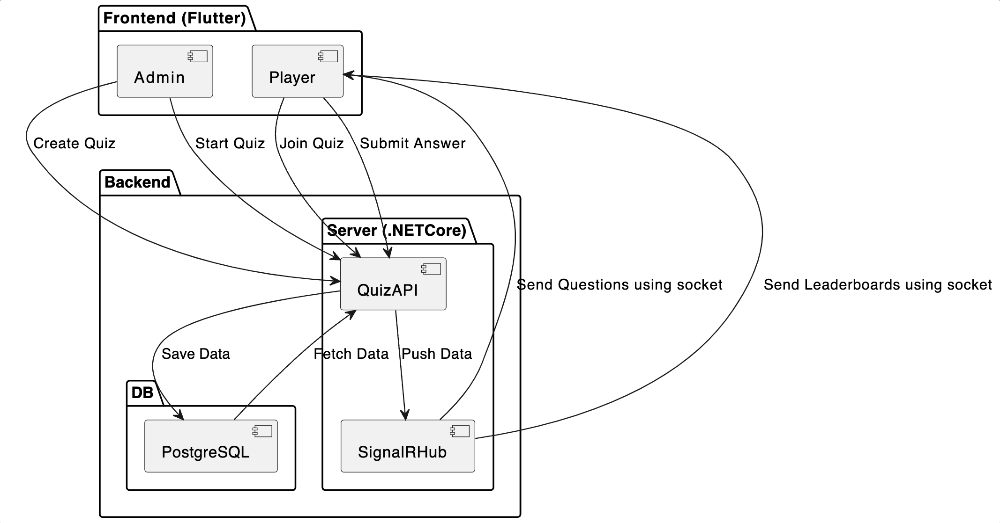
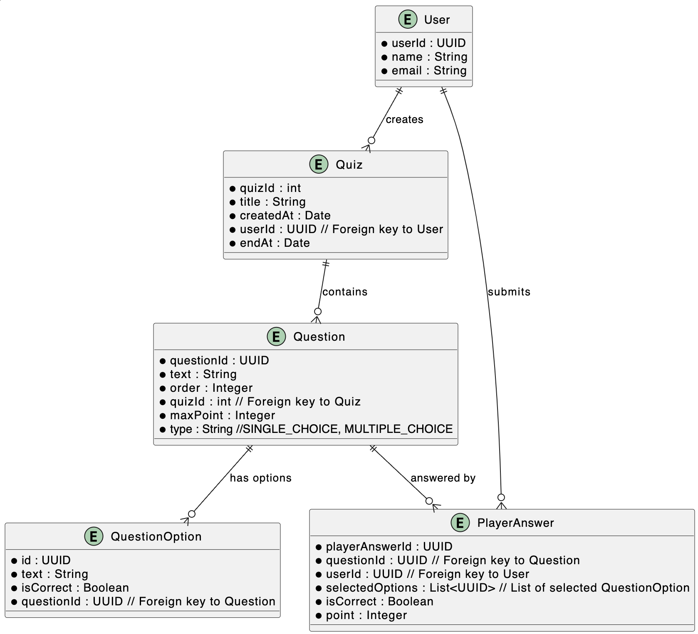
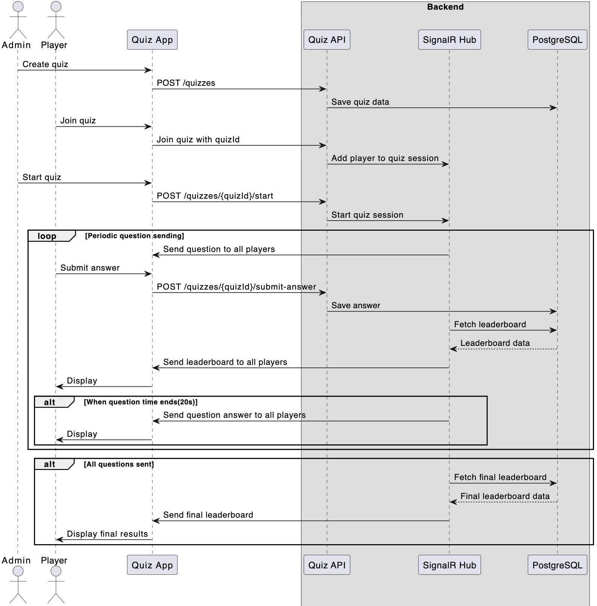

# RealTimeQuizSystem
 **The real-time quiz system, current features**:
 - create user
 - create quiz with single/multi choice questions.
 - join quiz
 - realtime questions
 - realtime leaderboard
 - multi players in one quiz session

 **Future features**:
 - other types of questions, such as user input.
 - dynamic points earned based on the time the answer is submitted.
 - exchange points for gifts.
## Start project guide
1. at root, run ```docker-compose up``` to start the server and database, check swagger file at http://localhost:5045/swagger/index.html
    ```
    server port: 5045
    database port: 5432
    ```
2. cd into QuizApp, run the app using Flutter version 3.24 
    ```
    flutter pub get
    flutter run
    ```
3. demo steps:
    1. run app in device 1
        - create user
        - create quiz
    2. run app in device 2
        - create user
        - join quiz by the id of created quiz in step 1
    3. at device 1, select start quiz
    4. at device 2, answer question

## Tech Stack

### 1. **Frontend: Flutter - 3.24.1 stable channel**
- **Libraries**:
    - **injectable and get_it**: manage dependency injection
    - **flutter_bloc**: state managment
    - **signalr_netcore**: socket client library to receive realtime data from server
- **User roles:**
    - **Admin**: Create, manage, and start quizzes.
    - **Player**: Join quizzes, receive real-time questions, and submit answers.
- **check more about code structure inside the Readme of folder QuizApp**
### 2. **Backend: .NET Core 8**
- **QuizAPI**: Handles quiz creation, player actions, and data persistence.
- **SignalR**: .NET socket library to sends real-time questions and leaderboard updates to players.
- **PostgreSQL**: Relational database, to stores quiz data, player information, answers, and scores.

## Diagrams
#### 1. Component diagram


#### 2. ERD


#### 3. Sequence diagram the whole flow from the quiz created to the leaderboard updated

